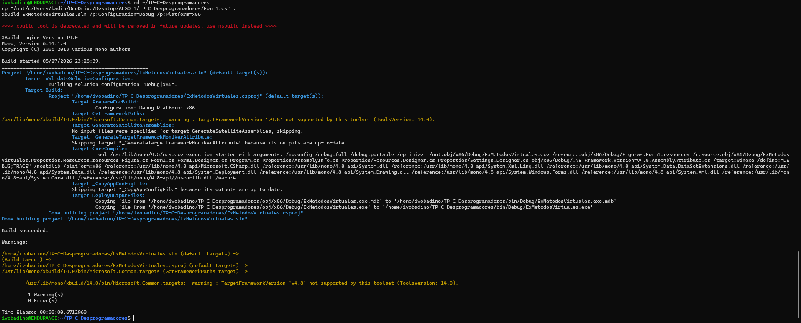
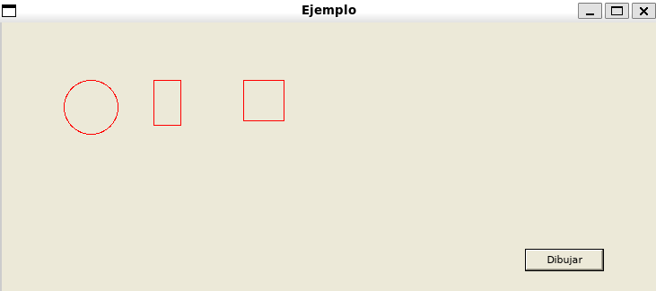
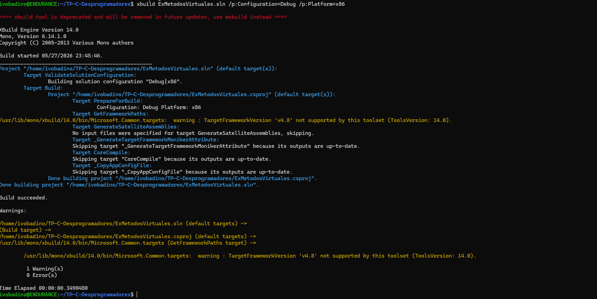
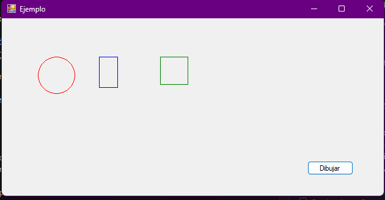
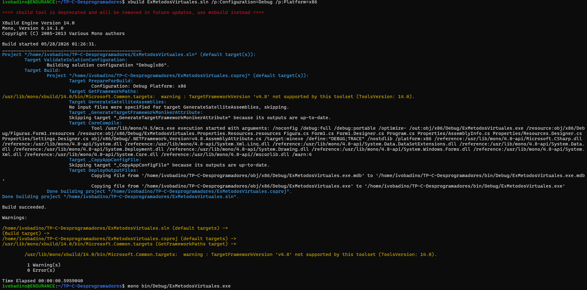
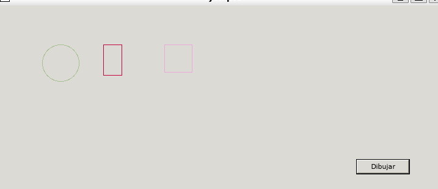
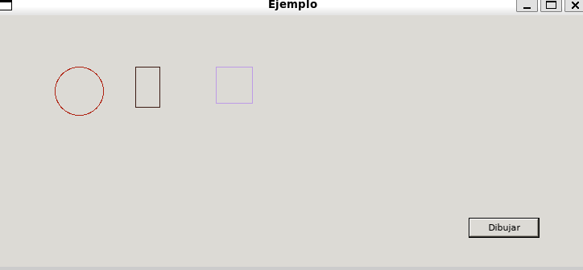
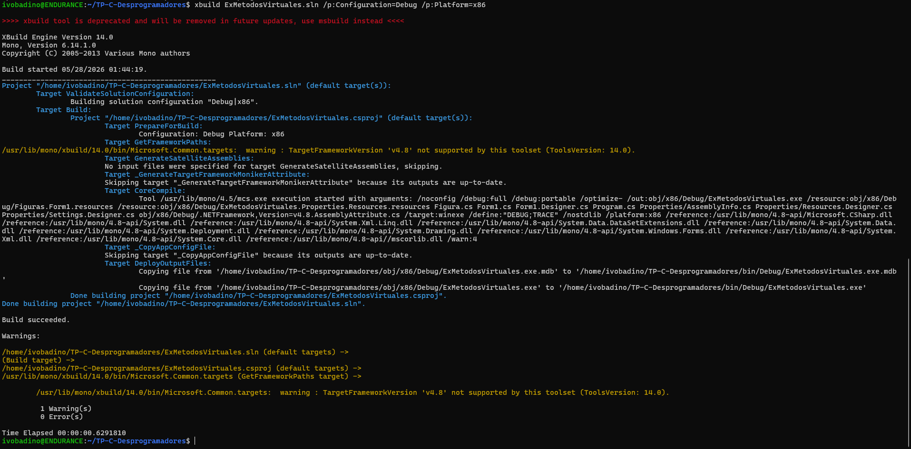
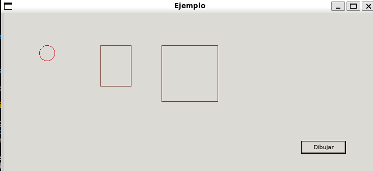

# ExMetodosVirtuales

Trabajo practico de introduccion a C# / .NET usando Mono en Linux.

## Compilacion en Linux con Mono

Para compilar el proyecto se utilizo Ubuntu en WSL y Mono.

Primero se instalo Mono:

```bash
sudo apt update
sudo apt install mono-complete
```

Luego se copio el proyecto a la carpeta personal de Linux para evitar problemas de permisos con OneDrive:

```bash
cd ~
cp -r "/mnt/c/Users/badin/OneDrive/Desktop/ALGO 1/TP-C-Desprogramadores" .
cd TP-C-Desprogramadores
```

Finalmente se compilo con:

```bash
xbuild ExMetodosVirtuales.sln /p:Configuration=Debug /p:Platform=x86
```

El resultado obtenido fue:


```text
Build succeeded.
1 Warning(s)
0 Error(s)
```

El ejecutable generado queda en:

```bash
bin/Debug/ExMetodosVirtuales.exe
```

## Parte 2.a: trazo rojo

Se modifico el color del lapiz utilizado para dibujar las figuras:

```csharp
Pen pen = new Pen(Color.Red);
```

Luego se recompilo el proyecto en Ubuntu con Mono:

```bash
xbuild ExMetodosVirtuales.sln /p:Configuration=Debug /p:Platform=x86
```

Resultado de la recompilacion:



Ejecucion del programa con las figuras en trazo rojo:



## Parte 2.b: colores distintos

Se agrego un color distinto para cada figura, manteniendo el recorrido general del arreglo:

```csharp
Color[] colores = new Color[3]
{
    Color.Red,
    Color.Blue,
    Color.Green,
};
```

Luego se recompilo el proyecto en Ubuntu con Mono:

```bash
xbuild ExMetodosVirtuales.sln /p:Configuration=Debug /p:Platform=x86
```

Resultado de la recompilacion:



Ejecucion del programa con las figuras en colores distintos:



## Parte 2.c.1: colores aleatorios

Se agrego un metodo para generar colores aleatorios usando `Random` y `Color.FromArgb`:

```csharp
private Color ColorAleatorio()
{
    int rojo = random.Next(0, 256);
    int verde = random.Next(0, 256);
    int azul = random.Next(0, 256);
    return Color.FromArgb(rojo, verde, azul);
}
```

Luego se recompilo el proyecto en Ubuntu con Mono:

```bash
xbuild ExMetodosVirtuales.sln /p:Configuration=Debug /p:Platform=x86
```

Resultado de la recompilacion:



Ejecuciones del programa con colores generados aleatoriamente:





## Parte 2.c.2: contraste minimo

Se agrego un control simple para evitar colores demasiado claros sobre el fondo blanco.
Para eso se calcula el brillo del color y se vuelve a generar si supera el limite elegido.

```csharp
brillo = (int)(0.299 * rojo + 0.587 * verde + 0.114 * azul);
```

## Parte 2.d: tamanos crecientes

Se modificaron los tamanos de las figuras para que se vean proporcionalmente crecientes de izquierda a derecha:

```csharp
figuras = new Figura[3]
{
    new Circulo(30),
    new Rectangulo(60, 80),
    new Cuadrado(110),
};
```

Luego se recompilo el proyecto en Ubuntu con Mono:

```bash
xbuild ExMetodosVirtuales.sln /p:Configuration=Debug /p:Platform=x86
```

Resultado de la recompilacion:



Ejecucion del programa con tamanos crecientes:


