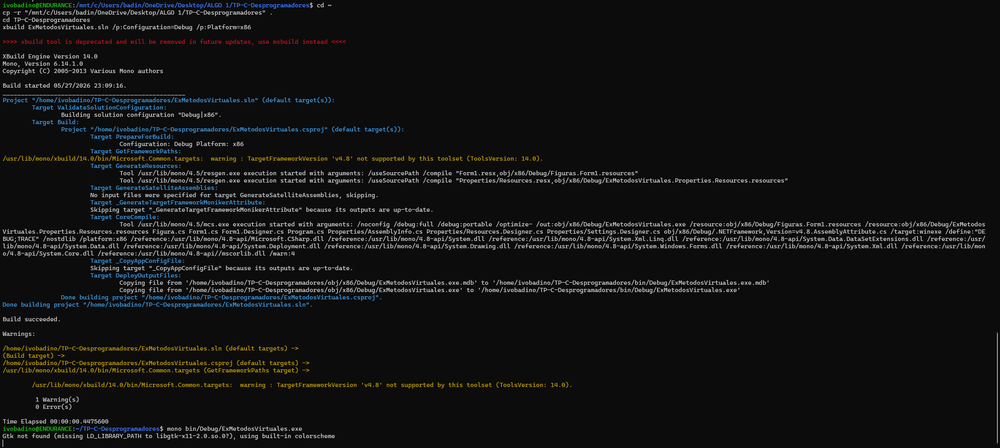

# ExMetodosVirtuales

Trabajo practico de introduccion a C# / .NET usando Mono en Linux.

## Compilacion en Linux con Mono

Para compilar el proyecto se utilizo Ubuntu en WSL y Mono.

Primero se instalo Mono:

```bash
sudo apt update
sudo apt install mono-complete
```

Luego se copio el proyecto a la carpeta personal de Linux para evitar problemas de permisos con OneDrive:

```bash
cd ~
cp -r "/mnt/c/Users/badin/OneDrive/Desktop/ALGO 1/TP-C-Desprogramadores" .
cd TP-C-Desprogramadores
```

Finalmente se compilo con:

```bash
xbuild ExMetodosVirtuales.sln /p:Configuration=Debug /p:Platform=x86
```

El resultado obtenido fue:



```text
Build succeeded.
1 Warning(s)
0 Error(s)
```

El ejecutable generado queda en:

```bash
bin/Debug/ExMetodosVirtuales.exe
```
